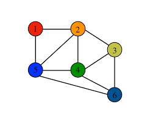

# Data Structure

## 스택(Stack)이란?
> 한 쪽 끝에서만 자료를 넣고 뺄 수 있는 LIFO 자료구조  
  

스택은 LIFO를 따르는데, LIFO란 나중에 들어간 항목이 가장 먼저 나오는 구조이다.

* pop() : 스택에서 가장 위에 있는 항목을 제거한다.  
* push() : item 하나를 스택의 가장 윗부분에 추가한다.  
* peek() : 스택의 가장 위에 있는 항목을 반환한다.  
* isEmpty() : 스택이 비어있을 때 true를 반환한다.  

### 스택의 구현
```java
public class Stack {
  private static class node {
    private T data;
    private n next;

    public node(T data) {
      this.data = data;
    }
  }

  private node top;

  public T pop() {
    if (top == null) throw new NoSuchElementException();
    T item = top.data;
    top = top.next;

    return item;
  }

  public void push(T item) {
    node t = new node(item);
    t.next = top;
    top = t;
  }

  public T peek() {
    if (top == null) throw new NoSuchElementException();
    return top.data;
  }

  public boolean isEmpty() {
    return top == null;
  }
}
```

### 스택의 사용 사례
* 재귀 알고리즘  
* 마지막 화면으로 항상 돌아와야 하는 경우 (웹 브라우저 방문 기록)  
* 역순 문자열 만들기
* 괄호 짝맞춤 검사  
* 후위 표기법 계산  

### java 라이브러리 스택 관련 메서드
* push(item)  
item을 Stack의 top에 삽입  
* pop()  
Stack의 top에 있는 item을 삭제하고 해당 item을 반환  
* peek()  
Stack의 top에 있는 item을 삭제하지 않고 해당 item을 반환  
* empty()  
Stack이 비어있으면 true를 반환 그렇지않으면 false를 반환  
* search(Object o)  
해당 Object의 위치를 반환  
---

## 그래프(Graph)란?
> 노드와 노드를 연결하는 간선(Edge)을 하나로 모아놓은 자료구조  
  


### 그래프와 트리의 구분  
|  | 그래프 | 트리 |  
|--|--|--|  
| 사이클 | 사이클 가능, 자체 간선 가능, 순환/비순환 그래프 모두 존재 | 사이클 불가능, 자체 간선 불가능, 비순환 그래프 |  
| 루트 노드 | 루트 노드 없음 | 한개의 루트 노드만이 존재 |  
| 부모-자식 |부모 자식 개념 없음 | 부모 자식 관계 |  
| 모델 | 네트워크 모델 | 계층 모델 |  

### 그래프의 종류
* 방향 그래프  
	* 간선에 방향성이 존재하는 그래프  
* 무방향 그래프  
	* 무방향 그래프의 간선은 양방향으로 통한다.  
* 가중치 그래프  
	* 간선에 비용이나 가중치가 할당된 그래프  

### 그래프의 탐색
* 깊이 우선 탐색  
루트 노드에서 시작해서 다음 브랜치로 넘어가기 전에 해당 브랜치를 모두 탐색하는 방법, 자식을 먼저 탐색한다고 보면 된다.  
넓게 탐색하기 전에 깊게 탐색한다.  
모든 노드를 방문하고자 하는 경우 이 방법을 선택한다.  
  
* 너비 우선 탐색  
루트 노드에서 시작해서 인접한 노드를 먼저 탐색하는 방법, 형제를 먼저 탐색하는 방법
깊게 탐색하기 전에 넓게 탐색한다.  
두 노드 사이의 최단 경로 혹은 임의의 경로를 찾고 싶을 때 선택한다.  
---

## 트리(Tree)란?
> 노드로 이루어진 자료구조  
  

1. 트리는 하나의 루트 노드를 갖는다.  
2. 루트 노드는 0개 이상의 자식 노드를 갖는다.  
3. 자식 노드 또한 0개 이상의 자식 노드를 갖고, 이는 반복적으로 정의된다.  
4. 비선형 자료구조로 계층적 관계를 표현한다.  

### 트리의 종류
* 이진 트리  
	* 각 노드가 최대 두개의 자식을 갖는 트리  
	* 모든 트리가 이진 트리는 아니다.  
	* 이진 트리의 순회에는 중위순회(왼,중,오), 전위순회(중,왼,오),후위순회(왼,오,중)  
* 균형 트리
	* O(logN) 시간에 insert, find를 할 수 있을 정도로 균형이 잘 잡혀있는 경우    
	* ex. 레드-블랙 트리, AVL트리    
* 완전 이진 트리
	* 트리의 모든 높이에서 노드가 꽉 차 있는 이진 트리. 즉, 마지막 레벨을 제외하고 모든 레벨이 완전히 채워져 있다.  
	* 마지막 레벨은 꽉 차 있지 않아도 되자만 노드가 왼쪽에서 오른쪽으로 채워져야 한다.  
	* 마지막 레벨 h에서 (1 ~ 2h-1)개의 노드를 가질 수 있다.  
	* 또 다른 정의는 가장 오른쪽의 잎 노드가 (아마도 모두) 제거된 포화 이진 트리다.  
	* 완전 이진 트리는 배열을 사용해 효율적으로 표현 가능하다.  
---

## 큐(Queue)란?
> 먼저 집어 넣은 데이터가 먼저 나오는 FIFO(First In First Out)구조로 저장하는 형식    
   

* add(item): item을 리스트의 끝부분에 추가한다.  
* remove(): 리스트의 첫 번째 항목을 제거한다.  
* peek(): 큐에서 가장 위에 있는 항목을 반환한다.  
* isEmpty(): 큐가 비어 있을 때에 true를 반환한다.  

### 큐(Queue)의 구현  
```java
public class MyQueue {
  private static class QueueNode {
    private T data;
    private QueueNode next;

    public QueueNode(T data) {
      this.data = data;
    }
  }

  private QueueNode first;
  private QueueNode last;

  public void add(T item) {
    QueueNode t = new QueueNode(item);

    if (last != null) last.next = t;
    last = t;
    if (first == null) first = last;
  }

  public T remove() {
    if (first == null) throw new NoSuchElementException();
    T data = first.data;
    first = first.next;

    if (first == null) last = null;
    return data;
  }

  public T peek() {
    if (first == null) throw new NoSuchElementException();
    return first.data;
  }

  public boolean isEmpty() {
    return first == null;
  }
}
```

### 큐의 사용 사례
* 너비 우선 탐색(BFS, Breadth-First Search) 구현  
* 처리해야 할 노드의 리스트를 저장하는 용도로 큐(Queue)를 사용한다.  
* 노드를 하나 처리할 때마다 해당 노드와 인접한 노드들을 큐에 다시 저장한다.  
* 노드를 접근한 순서대로 처리할 수 있다.  
* 캐시(Cache) 구현  
* 우선순위가 같은 작업 예약 (인쇄 대기열)  
* 선입선출이 필요한 대기열 (티켓 카운터)  
* 콜센터 고객 대기시간  

## 힙(Heap)이란?
* 완전 이진 트리의 일종으로 우선순위 큐를 위하여 만들어진 자료구조이다.  
* 여러 개의 값들 중에서 최댓값이나 최솟값을 빠르게 찾아내도록 만들어진 자료구조이다.  
* 힙은 일종의 반정렬 상태(느슨한 정렬 상태) 를 유지한다.  
* 큰 값이 상위 레벨에 있고 작은 값이 하위 레벨에 있다는 정도  
* 간단히 말하면 부모 노드의 키 값이 자식 노드의 키 값보다 항상 큰(작은) 이진 트리를 말한다.  
* 힙 트리에서는 중복된 값을 허용한다. (이진 탐색 트리에서는 중복된 값을 허용하지 않는다.)  

### 힙(heap)의 종류
* 최대 힙(max heap)  
부모 노드의 키 값이 자식 노드의 키 값보다 크거나 같은 완전 이진 트리  
key(부모 노드) >= key(자식 노드)  
* 최소 힙(min heap)  
부모 노드의 키 값이 자식 노드의 키 값보다 작거나 같은 완전 이진 트리  
key(부모 노드) <= key(자식 노드)  
  
### 힙의 삽입 연산

(이미지 출처: https://gmlwjd9405.github.io)  

### 힙의 삭제 연산 
  
(이미지 출처: https://gmlwjd9405.github.io)  
